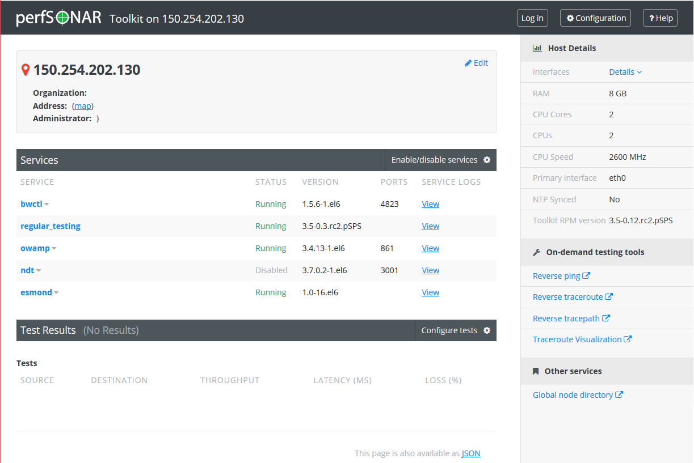

******************************************
Configuring the Toolkit for the First Time
******************************************

After installing the perfSONAR Toolkit, there are a few additional steps to be taken before you can begin using your new measurement host. Follow the sections on this page in order to complete the initial configuration and being performing network measurements with your perfSONAR Toolkit.

Your First Login
================
The first time you login to your Toolkit you will be prompted to create a user that can perform administrative actions via the web interface. 

.. note:: Versions prior to version 3.4 would allow the root user to login to the web interface. This was changed in version 3.4 for security purposes hence the required prompt.

Follow the prompts to complete the process as shown below:

#. Login with username *root* and the password you created during the installation process. You will get a prompt to create a new user:

    .. image:: images/install_config_first_time-user1.png
#. At the prompt enter the username you'd like to create.

    .. note:: The names *psadmin* and *perfsonar* are not allowed as they conflict with existing users and/or groups on the system.
    
    .. image:: images/install_config_first_time-user2.png
#. You will be prompted if you would like to user to be able to login via SSH. If this user will only be used to access the web interface, you may answer *no*. The default is to answer *no*.

    .. image:: images/install_config_first_time-user3.png
#. You will be prompted to give the user a password and then to confirm it. Remember this password as it will be used to log-in to the web interface to perform administrative functions. 

    .. image:: images/install_config_first_time-user4.png
#. After entering your password the account is created

    .. image:: images/install_config_first_time-user5.png

.. seealso:: For more information on adding and managing users see :doc:`manage_users`

Accessing the Web Interface
===========================
You may access the web interface by typing `http://<hostname>` in your web browser.

.. note:: For best results it is recommended a browser other than Internet Explorer is used due to some javascript incompatibilities. All other major browsers are supported.

You will be presented with a page like the following:

.. seealso:: For more information on the web interface see :doc:`manage_web_overview`.

Updating Your Administrative Information
========================================
You may notice on the left-side of the web interface that **Administrative Info** is highlighted in yellow. This is to highlight that this information needs to be populated. You will be prompted for basic location and contact information. This information is needed so other perfSONAR users can more accurately find your node. To populate the information do the following:

#. Open *http://<hostname>* in a web browser where *<hostname>* is the name or address of your host
#. Click on **Administrative Info** in the left menu and login as the user created in the previous step
    
    .. image:: images/install_quick_start-admininfo.png
#. On the page that loads, click the *Edit* button (1) and enter the requested information in the provided fields. Click *OK* (2) and then *Save* (3) when you are done.

    .. image:: images/install_quick_start-admininfo2.png
    .. seealso:: For more information on updating administrative information see :doc:`manage_admin_info`

After completing this step, you should be able to access the **Global Services** page and see your host listed within 24 hours of making the change.

Scheduling Regular Measurements
===============================
You will now want to schedule some tests that run on regular time intervals. There are two commonly used ways to add these tests and you may take one or both of these approaches depending on your needs:
 #. *Configure your tests via the web interface* - This approach can be used if you have a small number of perfSONAR nodes running a small number of tests. You will use the web interface to find and define tests. See :doc:`manage_regular_tests`.
 #. *Participate in a centrally managed mesh*  - This approach is best if you manage a large number of hosts or are participating in a large community of organizations running measurements. This requires updating a configuration file to point at a centrally managed file. See :doc:`multi_agent_config` for more details. 
 
What next?
==========
You should now have a fully configured host regularly collecting data. A few things you may consider exploring:

* Your regular tests record data that can be presented on graphs. To view the results on the toolkit provided graphs see the section :doc:`using_graphs`
* The perfSONAR Toolkit provides a number of on-demand testing tools you may be interested in exploring. More information can be found on the following pages:
    * :doc:`using_ndt`
    * :doc:`using_npad`
    * :doc:`using_rev_ping`
    * :doc:`using_rev_tracepath`
    * :doc:`using_rev_traceroute`
    * :doc:`using_oppd`

