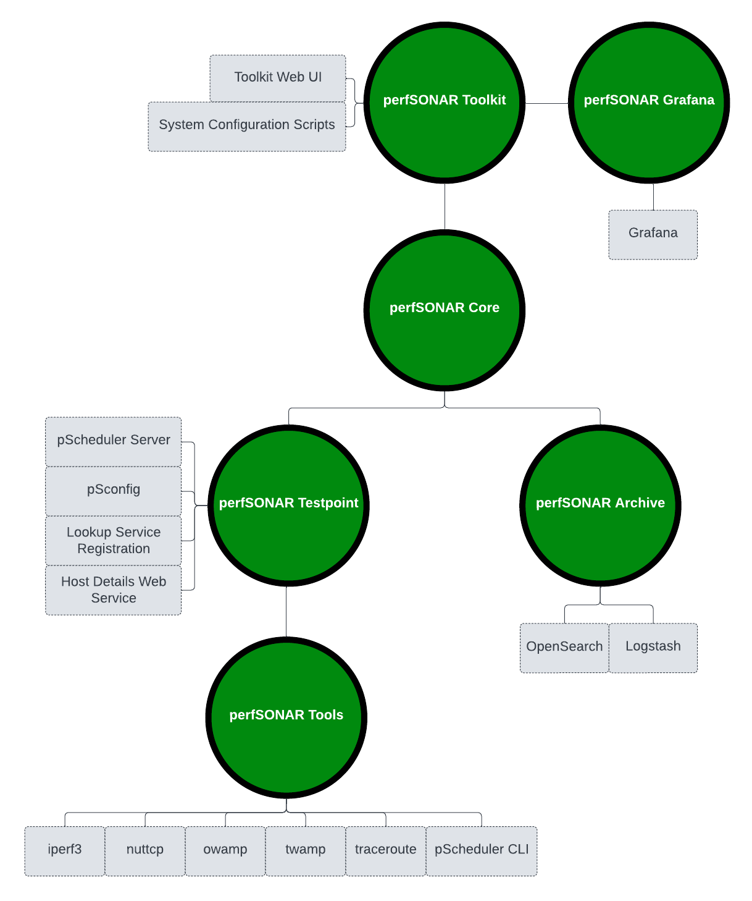

******************************
perfSONAR Installation Options
******************************

perfSONAR has historically been packaged as the **perfSONAR Toolkit**: an ISO containing a custom distribution of the CentOS operating system with all of the perfSONAR tools and services. The **perfSONAR Toolkit** is probably the best distribution for you if at least one or more of the following hold true:

* You are new to perfSONAR
* You plan to only deploy a small number of perfSONAR nodes
* You plan to use the CentOS operating system
* You do NOT wish to install perfSONAR on a host with the operating system already installed

Starting with perfSONAR 3.5, there are several other installation options as well for certain versions of both **CentOS** and **Debian/Ubuntu**. 

#. **perfsonar-tools:** This bundle includes just the command-line clients needed to run on-demand measurements such as iperf, iperf3, bwctl and owamp. This bundle is generally best for hosts that aren't dedicated measurement nodes but want the command-line utilities available for troubleshooting as the need arises.
#. **perfsonar-testpoint:** This includes everything from the perfsonar-tools package as well as the software required to:
      * Automatically run tests on a regular schedule
      * Participate in a centrally managed mesh of tests 
      * Publish the existence of a measurement node 

    This package does NOT contain the software required to store measurements locally in an archive; the archive must be remote. This is best for dedicated testers running on lightweight hardware platforms that have a remote location in which to publish results.
#. **perfsonar-core:** The perfsonar-core install includes everything in the perfsonar-testpoint install plus the esmond measurement archive used to store results. This is ideal for dedicated measurement hosts that want to store results locally, but do not want a full Toolkit install. In other words, they do not want to use a web interface and want the flexibility to choose default security and tuning settings.
#. **perfsonar-toolkit:** This includes everything in perfsonar-core plus:
    * The web interface used to manage tests
    * Scripts used to apply system-wide default tuning and security settings

    This package is for those that wish to install the full suite of tools included on the perfSONAR Toolkit ISO but on an existing Linux system. 
#. **perfsonar-centralmanagement:** The perfsonar-centralmanagement bundle is independent from the packages above and installs tools needed to centrally manage a large number of hosts and display their results. This includes the esmond measurement archive, tools for building meshes, and dashboard software for displaying results (maddash). 

.. _install_options_sysreq:

System Requirements 
===================

* **Operating System:**

  * Any system running either a 32-bit or 64-bit **CentOS 6** operating system should be able to follow the process outlined in this document. Other RedHat-based operating systems may work, but are not officially supported at this time.
  * Any system running either a 32-bit, 64-bit or ARM **Debian 7**, **Ubuntu 12** or **Ubuntu 14** is currently supported for the **perfsonar-testpoint** bundle.  Other Debian flavors derived from Debian 7 or Ubuntu 12 or 14 might work too but are not officially supported.

* **Hardware:** 

  * Most modern systems should be adequate to run the perfsonar-tools, perfsonar-testpoint and perfsonar-core bundles. We recommend at least 2GB of RAM and 20GB of disk space. 
  * For running a measurement archive, you should have at least 4GB of RAM, and 50GB of disk. 
  * You may want a 10Gbps network interface card depending on the throughput testing you wish to perform. 
  * See the `fasterdata.es.net hardware page <http://fasterdata.es.net/performance-testing/perfsonar/ps-howto/hardware/>`_ for suggested configurations.

.. seealso:: See the install instructions of each specific option for any further system requirements.
 

CentOS Toolkit ISO Installation 
===============================
* See :doc:`install_getting`

CentOS Bundle Installation 
==========================
* See :doc:`install_centos`

Debian Bundle Installation 
==========================
* See :doc:`install_debian` 

