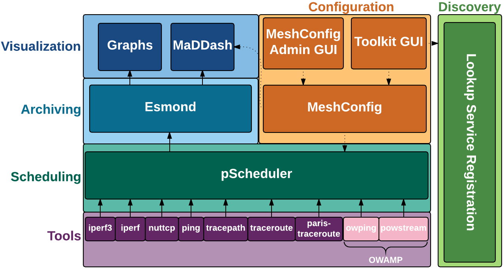

******************
What is perfSONAR?
******************

perfSONAR is a collection of open source software for performing and sharing end-to-end network measurements. It consists of multiple tools brought together in a manner best illustrated in the diagram below:

Your deployment may install some or all of the components depending on your goals. See :doc:`install_options` for a discussion on how to choose a deployment strategy that best suits your needs.

The sections that follow provide a brief in overview of the components at each layer and provide links to more detail where applicable. 

.. _intro_about-tools:

Tools
-----
perfSONAR includes numerous utilities responsible for carrying out the actual network measurements and form the foundational layer of perfSONAR. In general, you will not invoke these tools directly but instead use the :doc:`pscheduler<pscheduler_intro>` command from the :ref:`scheduling <intro_about-scheduling>` layer to execute them. The default tools that come with perfSONAR include:

    * owamp_ - A set of tools primarily used for measuring packet loss and one-way delay. It includes the command *owping* for single short-lived tests and the *powstream* command for long-running background tests. 
    * twamp_ - A tool primarily used for measuring packet loss and two-way delay. It has increased accuracy over tools like ping without the same clock synchronization requirements as OWAMP. The client tool is named *twping* and can be used to run against TWAMP servers. You can use the provided *twampd* server or many routers also come with vendor implementation of TWAMP servers that can be tested against. 
    * iperf3_ - A rewrite of the classic iperf tool used to measure network throughput and associated metrics.
    * iperf2_ - Also known as just *iperf*, a common tool used to measure network throughput that has been around for many years.
    * nuttcp_ - Another throughput tool with some useful options not found in other tools. 
    * traceroute_ - The classic packet trace tool used in identifying  network paths
    * tracepath_ - Another path trace tool that also measures path MTU
    * paris-traceroute_ - A packet trace tool that attempts to identify paths in the presence of load balancers
    * ping_ - The classic utility for determining reachability, round-trip time (RTT) and basic packet loss.

.. _intro_about-scheduling:

Scheduling
----------
The scheduling layer consists of a single tool named :doc:`pScheduler<pscheduler_intro>` and is responsible for:

    #. Finding time-slots to run the :ref:`tools <intro_about-tools>` while avoiding scheduling conflicts that would negatively impact results
    #. Executing the tools and gathering results
    #. Sending to the results to the :ref:`archiving<intro_about-archiving>` layer (if needed)
    
More information on using the pScheduler can be found in the section :ref:`index-pscheduler`.

.. _intro_about-archiving:

Archiving
----------
The archiving layer currently consists of components that store measurement information as time-series data. This layer is often referred to as the *measurement archive (MA)* and the plug-in architecture of pScheduler allows flexibility in what software is used at this layer. The default that ships with perfSONAR is a combinaton of `Logstash <https://www.elastic.co/logstash/>`_ and `OpenSearch <https://opensearch.org/>`_. These are externally developed open source components that add aadditional metdata and allow it to be queried in a flexible manner. The components can be installed on each measurement host if they meet hardware requirements or a single central instance may store results from multiple measurement hosts. For more information see :doc:`multi_ma_install`.

.. note: The :doc:`pScheduler<pscheduler_intro>` component does allow the creation of plug-ins for sending results to other types of archives, this is just the setup included with relevant perfSONAR bundles by default. See :doc:`pscheduler_ref_archivers` for a list of a few other options currently available as plug-ins. 

.. _intro_about-configuration: 

Configuration
-------------

The configuration layer is where desired measurements are defined along with instructions on where to store them. The primary component at this layer is called *pSConfig*. pSConfig is a *template* framework for describing and configuring a *topology* of *tasks*. If you manage more than one perfSONAR host (or participate in a distributed community of perfSONAR measurement hosts), the following configuration tasks can quickly become unwieldy:

    #. **Scheduling the tasks** you want to run at each location. 
    #. **Maintaining visualization components** to display results of the measurements from multiple hosts

pSConfig assists with these challenges by providing agents to automate each of the configuration tasks listed above. This includes:

    #. **pSconfig pScheduler Agent** - The agent responsible for reading a template and configuring the tasks defined in pScheduler. See :doc:`psconfig_pscheduler_agent` for more details on this agent.
    #. **pSConfig MaDDash Agent** - The agent responsible for reading a template and configuring MaDDash to display the results of defined tasks in a dashboard. See :doc:`psconfig_maddash_agent` for more details on this agent.

For complete information on pSConfig start with :doc:`psconfig_intro` for more details on pSConfig basic concepts/terminology.

.. _intro_about-visualization:

Visualization
--------------

perfSONAR also includes components for visualizing the data. These components provide a window into the data and are the primary way most operators analyze and identify network issues.  The primary tools provided by the main perfSONAR project are:

    * **Graphs** - The perfSONAR graphs package provides a set of graphs that display the various measurements over time and provide useful information about the hosts involved. See :doc:`using_graphs` for more detail.
    * **MaDDash** - This component queries the :ref:`archiving layer <intro_about-archiving>` periodically for measurements and displays a dashboard indicating the performance of each relative to a set of defined thresholds. It can also send alerts based on patterns in the dashboard. See the :doc:`MaDDash documentation <maddash_intro>` for more details.

In addition to displaying results, there are also graphical interfaces available for configuring perfSONAR components:

    * **Toolkit GUI** - This ships with every perfSONAR Toolkit and allows defining tasks for the local pSConfig pScheduler agent. See :doc:`manage_regular_tests` for more details.
    * **pSConfig Web Admin** - This is a web-based application for defining remote templates that can be read by the pSConfig Agents. See :doc:`pwa` for more details.
    
.. _intro_about-discovery:

Discovery
---------
Each perfSONAR node can run a component called the **Lookup Service (LS) Registration Daemon** that registers its existence in a public and/or private `lookup service <http://software.es.net/simple-lookup-service/>`_. The registration daemon gathers information about each perfSONAR layer as well as the host on which it runs. This information is then used in multiple places to help debug problems and find hosts with which to test when building new configurations. 

In general, no configuration is needed of the registration component but for a guide of the options available see :doc:`config_ls_registration`.

.. _owamp: http://github.com/perfsonar/owamp
.. _twamp: http://github.com/perfsonar/owamp
.. _iperf3: http://software.es.net/iperf
.. _iperf2: https://sourceforge.net/projects/iperf2/
.. _nuttcp: https://fasterdata.es.net/performance-testing/network-troubleshooting-tools/nuttcp/
.. _traceroute: https://linux.die.net/man/8/traceroute
.. _tracepath: https://linux.die.net/man/8/tracepath
.. _paris-traceroute: http://manpages.ubuntu.com/manpages/trusty/man8/paris-traceroute.8.html
.. _ping: https://linux.die.net/man/8/ping
