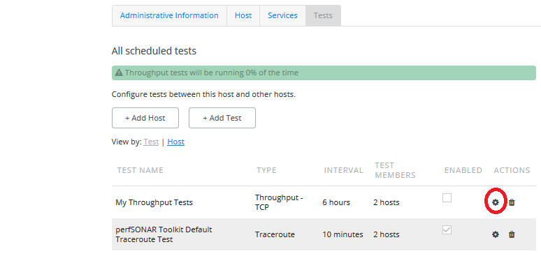

*************************
Configuring Regular Tests
*************************

A core function of the perfSONAR Toolkit is to run regularly scheduled network measurements. You can define the tests you want run through the toolkit's web interface. This section describes using the interface to manage the set of tests run by tour toolkit node.

.. seealso::  See :doc:`Mesh Configuration Quick Start <multi_overview>` for information on an alternative way to configure tests when your host is participating in a large community or you manage multiple hosts. 

.. _manage_reg_tests_access:

Accessing the Configuration interface
=====================================
#. Open **http://<hostname>** in your browser where **<hostname>** is the name of your toolkit host
#. Click on *Configure Tests* in the left-hand menu

    .. image:: images/manage_regular_tests-configtests1.png
#. Login using the web administrator username and password.
    .. seealso:: See :doc:`manage_users` for more details on creating a web administrator account
#. The page that loads can be used to manage regular tests. See the remainder of this document for details on :ref:`adding <manage_reg_tests_add>`, :ref:`modifying <manage_reg_tests_modify>`, :ref:`disabling <manage_reg_tests_disable>` and :ref:`deleting <manage_reg_tests_delete>` tests.

    .. image:: images/manage_regular_tests-configtests2.png

.. _manage_reg_tests_types:

Types of Regular Tests
======================
Multiple types of tests can be configured through the web interface. They are described below:

.. glossary::

    Throughput
        This type of test measures the amount of data that can be transferred over a period of time. It is implemented using a tool called BWCTL that make sures the throughput tests do not conflict with each other. BWCTL executes another tool called iperf to actually transfer the data and measure the results. By default it prefers the newest version of iperf, `iperf3 <http://software.es.net/iperf/>`_, but will fallback to an older version automatically if the remote endpoint does not support it. 

    Ping
        This type of test measures the round-trip-time of packet and other statistics such as loss. The BWCTL tool is used to manage the schedule and it spawns a ping command to perform the actual measurement. Ping collects similar statistics to the one-way latency test (such as packet loss) but does so at a much less granular level and without regard for whether the measured value occurred on the forward or reverse path. The advantage of ping tests is that many sites accept ping tests without the need for firewall modifications or special daemon's running on the target host.
        
    One-way Delay
        This type of test measures delay and loss separately for each direction of a path (as opposed to combining the values of each direction as ping tests). The underling tool run is an OWAMP client. This type of test runs constantly sending several packets each seconds. This allows it to find very small amounts of loss if present that may be missed by other tools. If also running throughput tests, you may see anomalies such as a sudden burst of loss when throughput tests run. For this reason it is often recommended you run this type of test on a separate interface or host than the throughput tests. See :doc:`manage_dual_xface` for more information on running tests on separate interfaces.

    Traceroute
        Traceroute tests periodically measure the path between the source and destination. By default this type of test will automatically be added every time you add any of the other types of tests. This type of test is crucial in determining how a packet traverses a network and can be helpful in identifying events such as path changes that affect other test types. The underlying tool is BWCTL to manage scheduling the test and the traceroute command to actual perform the measurement.
        
        
.. _manage_reg_tests_add:

Adding Regular Tests
====================
#. On the main page of the configuration interface you will see buttons for each :ref:`test type<manage_reg_tests_types>`. Click on the button for the test type you would like to add.

    .. image:: images/manage_regular_tests-configtests-add1.png
#. A pop-up will appear prompting you for the parameters of the test. Each prompt contains a *Description* field you are required to define. The *Description* is a human-readable string and will only be used on this interface to identify the test. The remaining parameters are detailed in the tables below:

    .. _manage_reg_tests_add_params:

    **Throughput**

    +-----------------------+------------+-------------------------------------+
    | Field                 | Default    | Description                         |
    +=======================+============+=====================================+    
    | Interface             | Default    | |add_params_iface|                  |
    +-----------------------+------------+-------------------------------------+
    | Time Between Tests    | 6 hours    | |add_params_throughput_interval|    |
    +-----------------------+------------+-------------------------------------+
    | Test Duration         | 20 seconds | |add_params_throughput_duration|    |
    +-----------------------+------------+-------------------------------------+
    | Protocol              | TCP        | |add_params_throughput_protocol|    |
    +-----------------------+------------+-------------------------------------+
    |    UDP Bandwidth      | Not set    | |add_params_throughput_udp_bwidth|  |
    +-----------------------+------------+-------------------------------------+
    | Use Autotuning        | Yes        | |add_params_throughput_autotune|    |
    +-----------------------+------------+-------------------------------------+
    |    Window Size        | Not Set    | |add_params_throughput_window_size| |
    +-----------------------+------------+-------------------------------------+
    | TOS bits              | 0          | |add_params_throughput_tos|         |
    +-----------------------+------------+-------------------------------------+
    
    **Ping**

    +-----------------------+------------+-------------------------------------+
    | Field                 | Default    | Description                         |
    +=======================+============+=====================================+    
    | Interface             | Default    | |add_params_iface|                  |
    +-----------------------+------------+-------------------------------------+
    | Time Between Tests    | 5 minutes  | |add_params_ping_interval|          |
    +-----------------------+------------+-------------------------------------+
    | Packets Sent Per Test | 10         | |add_params_ping_packets|           |
    +-----------------------+------------+-------------------------------------+
    | Time Between Packets  | 1 second   | |add_params_ping_packet_interval|   |
    +-----------------------+------------+-------------------------------------+
    | Size of Test Packets  | 1000 bytes | |add_params_ping_size|              |
    +-----------------------+------------+-------------------------------------+
    
    **One-way delay**

    +-----------------------+-----------------------+-------------------------------------+
    | Field                 | Default               | Description                         |
    +=======================+=======================+=====================================+    
    | Interface             | Default               | |add_params_iface|                  |
    +-----------------------+-----------------------+-------------------------------------+
    | Packet Rate           | 10 packets per second | |add_params_owdelay_packet_rate|    |
    +-----------------------+-----------------------+-------------------------------------+
    | Packet Size           | 20 bytes              | |add_params_owdelay_packet_size|    |
    +-----------------------+-----------------------+-------------------------------------+
    
    **Traceroute**

    +-----------------------+------------+-------------------------------------+
    | Field                 | Default    | Description                         |
    +=======================+============+=====================================+    
    | Interface             | Default    | |add_params_iface|                  |
    +-----------------------+------------+-------------------------------------+
    | Time Between Tests    | 10 minutes | |add_params_traceroute_interval|    |
    +-----------------------+------------+-------------------------------------+
    | Packets Size          | 40 bytes   | |add_params_traceroute_packet_size| |
    +-----------------------+------------+-------------------------------------+
    | First Hop to Report   | 1          | |add_params_traceroute_first_hop|   |
    +-----------------------+------------+-------------------------------------+
    | Maximum Number of Hops| 30         | |add_params_traceroute_max_hops|    |
    +-----------------------+------------+-------------------------------------+
    
#. Click the **Add** button when you are done adjusting the settings

    .. image:: images/manage_regular_tests-configtests_add2.png
#. On the page that loads you will be able to add hosts to which you want to test. There are multiple ways to add hosts:
    .. _manage_reg_tests_add_host_manual:
    
    .. container:: topic
        
        **Option 1: Manually add a new host**
        
        #. You may enter an IP or hostname manually. You can do this by first clicking the **Add New Host** button
        
            .. image:: images/manage_regular_tests-configtests_addman1.png
        #. In the prompt enter the address of the host you wish to add in the *Host* field. Depending on the test type you may also add the port in the *Port* field. In most cases you will want to use the default port. You can also add a human-readable description to the *Description* field that will only be used by this interface when displaying the host.
            
            .. image:: images/manage_regular_tests-configtests_addman2.png
        #. When you are done click **Add**. Repeat these steps if you would like to manually add more hosts to the test set.
        
            .. image:: images/manage_regular_tests-configtests_addman3.png
    
    .. _manage_reg_tests_add_host_community:
    .. container:: topic 
    
        **Option 2: Search for hosts by community**
        
        #. Many hosts tag themselves as belonging to a particular *community*. Communities are just free-form tags used for organization purposes. You can browse hosts by community using the toolkit regular testing interface. The regular testing interface contains a word cloud of communities where communities with larger text have more members. Click on a community to view its members.
            
            .. image:: images/manage_regular_tests-configtests_addcomm1.png
        #. This will load a list of hosts in a given community. If you wish to add a host to your test, click on *Add to test* 
        
            .. image:: images/manage_regular_tests-configtests_addcomm3.png
        #. Repeat these steps to find and add more hosts by community.
#. After adding your tests you may want to verify IPv4 and IPv6 are being tested as intended. You can do so by looking at the right-most column:
    .. _manage_reg_tests_add_ip_type:
    
    .. image:: images/manage_regular_tests-configtests-addiptype.png

    Valid values are:
        * *ipv4 only* - One test is run to the target host using IPv4
        * *ipv6 only* - One test is run to the target host using IPv6
        * *ipv4 and ipv6* - Two tests are run to the target host: one using IPv4 and another using IPv6
    By default the interface will automatically decide on whether to setup an IPv4 and/or an IPv6 test. The behavior is described below:
        * If the selected local interface has both IPv4 and IPv6 address AND the address added to the test is a hostname with both IPv4 and IPv6 entries, then both an IPv4 and IPv6 test will be setup.
        * If the local interface has only an IPv4 address or the remote host is an IPv4 address (or a hostname with only an IPv4 entry), then only an IPv4 test will be setup.
        * If the local interface has only an IPv6 address or the remote host is an IPv6 address (or a hostname with only an IPv6 entry), then only an IPv6 test will be setup.
        
    .. seealso:: See :ref:`manage_reg_tests_modify_ip` for more details on what these fields mean and how to modify them

#. Take note that a traceroute test is automatically added when you add a non-traceroute test. If you are content with this setup then there is nothing to do. If you would like to remove these tests click *Delete*. See :ref:`manage_reg_tests_modify_delmember` and :ref:`manage_reg_tests_delete` for more details on removing these tests if you so desire.
    
    .. image:: images/manage_regular_tests-configtests_addtrace.png
#. If you would like to add more tests, you may return to step 1. Otherwise click the **Save** button to apply your changes.
    
    .. image:: images/manage_regular_tests-configtests_add_save.png
#. Wait while the configuration is applied and services are restarted.
    .. image:: images/manage_regular_tests-configtests_add_saving.png
#. Your tests should now be running and you should see the message below on the top of the screen. 
    .. image:: images/manage_regular_tests-configtests_add_saved.png
#. It may take several hours for throughput data to appear and several minutes (depending on the time between tests) for the other test types. If the tests are working you should be able to data in the graphs.

    .. seealso:: See :doc:`using_graphs` for details on reading graphs

.. _manage_reg_tests_modify:

Editing Regular Tests
=====================

You may modify settings of a test set after adding it . Access the regular testing interface and click **Configure** next to any test you wish to change:

From the page that loads you can make a number of changes. See the sections that follow for details on how to make some specific changes.

.. _manage_reg_tests_modify_params:

Changing Test Parameters
------------------------

#. Click on **Edit Test Parameters**

    .. image:: images/manage_regular_tests-configtests-edit-params1.png
#. Use the prompt to change the desired settings. See the tables :ref:`here<manage_reg_tests_add_params>` for complete listing of parameters and their meanings. Click **Set** to leave the prompt and keep your changes.

    .. image:: images/manage_regular_tests-configtests-edit-params2.png

#. If you are done making changes click **Save** to apply your changes

.. _manage_reg_tests_modify_delmember:

Deleting Test Members
---------------------

#. Find the test member you wish to remove and click **Delete**

    .. image:: images/manage_regular_tests-configtests-edit-del1.png
#. You should no longer see the host in the list

    .. image:: images/manage_regular_tests-configtests-edit-del2.png
#. If you are done making changes click **Save** to apply your changes

.. _manage_reg_tests_modify_addmember:

Adding Test Members
---------------------

From the configuration interface, the process for adding more test members is the same as that detailed in the section :ref:`manage_reg_tests_add`. Specifically see the discussion on :ref:`manually adding a host <manage_reg_tests_add_host_manual>` and :ref:`adding a host by community <manage_reg_tests_add_host_community>` for more details.

.. _manage_reg_tests_modify_ip:

Changing Test Member IP Address Settings
-----------------------------------------
When you add a new test member, the configuration automatically determines if you should the test should run using IPv4, IPv6 or both. See the :ref:`discussion <manage_reg_tests_add_ip_type>` on IP type when adding a new test for more details on the default behavior. If you would like to override the default behavior or update the host address do the following:

#. Find the test member you would like to update and click the **Edit** button
    
    .. image:: images/manage_regular_tests-configtests-edit-ip1.png
#. In the prompt change the fields you wish to update. Click **Set** to leave the prompt and maintain your changes

    .. warning:: Checking the IPv4 and IPv6 or text boxes will create a test that forces that address family. If the local interface or remote host does not support that address type your test will be unable to run. For example, if the remote host is an IPv4 address but only the IPv6 checkbox is selected then it will be impossible to run a test. There is also a warning in the web interface in these cases.
    
    .. image:: images/manage_regular_tests-configtests-edit-ip2.png
    
#. If you are done making changes click **Save** to apply your changes

.. _manage_reg_tests_disable:

Disabling/Enabling Regular Tests
================================

.. _manage_reg_tests_disable_disable:

Disabling a Regular Test
------------------------

In some cases it may be desirable to stop running tests for a period of time, but not to delete them entirely. This allows them to be enabled again at a later time without recreating the entire test set. To disable an existing test set do the following:

#. On the regular testing interface, click **Disable** next to the test set you would like to disable.

    .. image:: images/manage_regular_tests-configtests-disable1.png
#. This should strike-out the text of the disabled test as shown below

    .. image:: images/manage_regular_tests-configtests-disable2.png
#. When you are done making changes click the **Save** button.

.. _manage_reg_tests_disable_enable:

Enabling a Regular Test
-----------------------

If you have previously :ref:`disabled a test <manage_reg_tests_disable_disable>` and wish to enable it again do the following:

#. On the regular testing interface, click **Enable** next to the test set you would like to enable. Only currently disabled tests (those with with stuck out text) will have this option next to them. 

    .. image:: images/manage_regular_tests-configtests-enable1.png
#. The text should no longer be struck out

    .. image:: images/manage_regular_tests-configtests-enable2.png
#. When you are done making changes click the **Save** button.

.. _manage_reg_tests_delete:

Deleting Regular Tests
======================

The interface allows you to completely delete a test set. This will stop all tests in the set from running and completely remove them from the configuration interface. If after deleting a test set, you would like to re-add the tests, you will have to completely recreate the test set.

.. note::  Deleting a test set will NOT delete the historical results stored on the host. You will be able to view the historical data on the graphs after deleting the test set.

You may delete a test with the following steps:

#. On the regular testing interface, click **Delete** next to the test set you would like to delete.

    .. image:: images/manage_regular_tests-configtests-delete1.png
#. A message will be shown indicating the test has been removed and it will no longer appear in the list

    .. image:: images/manage_regular_tests-configtests-delete2.png
#. When you are done making changes click the **Save** button.
    

.. |add_params_iface|  replace:: The network interface on which to run the test. The default is the default interface of the host. Use this field if you have multiple interfaces and want to specify the interface where this test runs. 

.. |add_params_throughput_interval|     replace:: The amount of time in between tests. Throughput tests consume bandwidth so usually only run a few times a day. The default is every 6 hours. Note that the tests will not run exactly every 6 hours as some randomization occurs to prevent tests from running  in sequence at the beginning of the interval.
.. |add_params_throughput_duration|     replace:: The length of the tests to be run.  TCP requires time to *ramp up*, especially as the latency increases.  Consider using a larger value if the test subjects are further away.  
.. |add_params_throughput_protocol|     replace:: The transport protocol to be used. It can be TCP or UDP.
.. |add_params_throughput_udp_bwidth|   replace:: Field only appears if **Protocol** is set to **UDP**. For UDP this sets the target bandwidth in Mbps. Note that you should be careful with high values since UDP is not a "fair" protocol (in contrast to TCP) and will not back-off on bandwidth if it encounters other traffic.  Also note that many BWCTL instances disable UDP by default, setting this option may require coordination with remote testers to allow the test to complete.  
.. |add_params_throughput_autotune|     replace:: Allows the TCP window size to be automatically calculated.
.. |add_params_throughput_window_size|  replace:: If **Use Autotuning** is not checked then this field appears. Manually sets the value of the TCP window size.
.. |add_params_throughput_tos|          replace::  A value between 0 and 255 that will be set in the TOS field of the IP header, and will only have impact on networks that support QoS specifications. If you are unsure about this field, leave the default.

.. |add_params_ping_interval|           replace:: The amount of time in between tests. Ping tests are low bandwidth and generally run every few minutes.
.. |add_params_ping_packets|            replace:: The number of packets to send per test. Multiplying by the **Time between packets** yields the duration of the test in seconds. 
.. |add_params_ping_packet_interval|    replace:: The time to wait in between sending packets. Multiplying by the **Packets sent per test** yields the duration of the test in seconds. 
.. |add_params_ping_size|               replace:: The size of the packets sent

.. |add_params_owdelay_packet_rate|     replace:: The number of packets sent each second. Note that each OWAMP daemon has limitations on the bandwidth for tests.  If the packet rate and packet size exceed available bandwidth, tests may be denied.  
.. |add_params_owdelay_packet_size|     replace:: The size of the packets sent.  Note that each OWAMP daemon has limitations on the bandwidth for tests.  If the packet rate and packet size exceed available bandwidth, tests may be denied.  

.. |add_params_traceroute_interval|     replace:: The amount of time in between tests. Traceroute tests are low bandwidth and may run every few minutes.
.. |add_params_traceroute_packet_size|  replace:: The size of the packets sent
.. |add_params_traceroute_first_hop|    replace:: The first hop to report starting at 1. The default is to report all hops. If you would like to hide the first few hops, set this to a value greater than 1. 
.. |add_params_traceroute_max_hops|     replace:: The maximum number of hops to traverse before the traceroute is abandoned.
