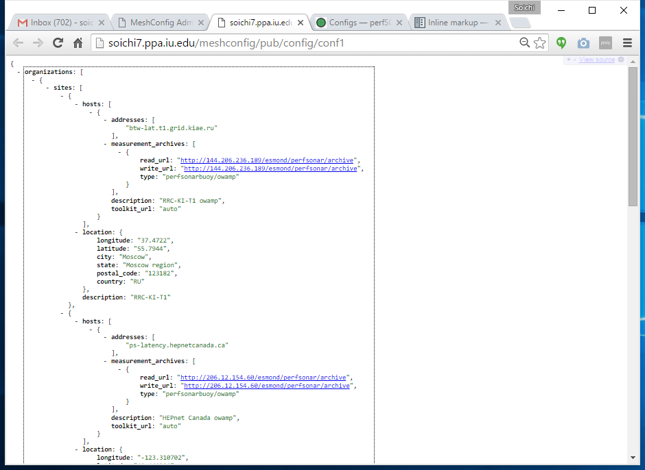

*****************
Configs
*****************

Once you define your Host Groups and Test Specs, you can now define a meshconfig by combining those entities.

Auto Mesh Config
----------------------------------

.. image:: images/mca/autoconfig.png

Under "Configs" tab, you immediately see "Auto Mesh Config". Auto Mesh Config a special meshconfig which is generated by aggregating all tests defined in vairous
meshconfig for a specific host. Auto meshconfig is useful if you want to configure a toolkit instance so that it will run all tests defined by any meshconfigs 
rather than picking a specific meshconfig.

To generate Auto meshconfig, simply choose a hostname from the hostname dropdown list.

Mesh Config List
----------------------------------

.. image:: images/mca/configs_sub.png

Under the "Auto Mesh Config" section, you will see a list of meshconfig defined and their basic information. The links displayed next to the config name is the actual meshconfig URLs that users can download and subscribe on various perfSonar services. To edit, or see more detail for each meshconfig, click on a pencil button (or "eye" button if you don't have edit access) on the right side of the record.

Adding Mesh Config
----------------------------------

Start adding a new mesh config by clicking "Add New" at the buttom of the page.

.. image:: images/mca/newmeshconfig.png

* Config Name: Name of the config. Also used as description for mesh config

* url: Trailing URL for this mesh config. For example, if you enter us-atlas, you will be able to download this mesh config via http://<hostname>/meshconfig/pub/us-atlas

* Admins: List of users can edit this meshconfig.

Each meshconfig can contains more than 1 tests. To add a new test, click "Add New Test" button.

.. image:: images/mca/newtest.png

Enter a name for this test, and select service type and meshtype. See :ref:`config_mesh-group-type` for more detail.

Once you select service type and meshtype, you can now select hostgroup(s) and testspec. MCA shows members of the host group you have selected as shown below.

.. image:: images/mca/testpopulated.png

After you've added all tests, please be sure click "Update" at the bottom of the page to save your changes.

You should now able to browse generated meshconfig via the link shown on the Configs list page.

.. image:: images/mca/meshconfigurl.png

If you want to browse JSON files formatted in human readable way, you can install `JSONView <https://chrome.google.com/webstore/detail/jsonview/chklaanhfefbnpoihckbnefhakgolnmc?utm_source=chrome-app-launcher-info-dialog>`_ extension for Chrome, or similar plugins for other browsers.
