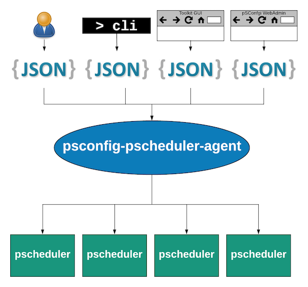

**************************************************************
Running the pSConfig pScheduler Agent
**************************************************************

.. _psconfig_pscheduler_agent-intro:

Introduction
===============

.. _psconfig_pscheduler_agent-intro-role:

pSConfig pScheduler Agent's Role
---------------------------------
The role of the *pSConfig pScheduler Agent* is to read :doc:`pSConfig templates <psconfig_intro>` and generate a set of :doc:`pScheduler <pscheduler_intro>` :term:`tasks <task>`. The diagram below describes this role:

    
    *A diagram showing the psconfig-pscheduler-agent reading templates from a number of sources and submitting tasks to pScheduler servers.*
    
Performing this role is a multi-step process that includes the following:

#. Read the templates and optionally perform local modifications to the template
#. Determine the pScheduler tasks to schedule
#. Communicate with the appropriate pScheduler servers to ensure the tasks are created.

These steps are completed when the following events occur:

* The agent starts
* Within a configurable amount of time of a change to a *local* configuration file (changes to remote files are not detected). By default the value is *1 minute*.
* If no changes, on a configurable interval after the start of the last run. By default these steps are run every *1 hour*. 

.. note:: See :ref:`psconfig_pscheduler_agent-advanced` for more detail on the configuration options mentioned above. 

The remainder of this section describes each of these steps in greater detail.

.. _psconfig_pscheduler_agent-intro-read:

Reading and Modifying Templates
----------------------------------
The agents first job is to read a set of :doc:`templates <psconfig_templates_intro>`. The templates to read are configured by the administrator of the agent. For information on how to configure templates see :ref:`psconfig_pscheduler_agent-templates`.

After reading a template an agent is also capable of performing local modifications to that template. The types of modifications supported include:

* Direct transformations to the template JSON. See :ref:`psconfig_pscheduler_agent-transforms` for more detail.
* Inclusion of default archives for all tasks. See :ref:`psconfig_pscheduler_agent-archives` for more detail.

.. _psconfig_pscheduler_agent-intro-determine:

Determining the pScheduler Tasks to Create
-------------------------------------------
An individual agent is not necessarily responsible for creating and managing all the tasks described by a template. Instead, an agent looks at the :ref:`address objects <psconfig_templates_intro-concepts-addresses>` associated with individual tasks and only concerns itself with those it is configured to manage. It determines these addresses as follows:

*  By default, the agent detects the addresses on the local interfaces of the host which it runs. 
*  The default behavior can be overriden by setting the ``addresses`` option in the default configuration file. See :ref:`psconfig_pscheduler_agent-advanced` for more detail.

Once it has the list of addresses for which it is responsible, it is not just a matter of seeing if one of the addresses is in the generated address list for a task. Instead, it must also analyze if the address it matches is also the one designated to schedule the task. This designation is dependent on the task configuration. A full discussion of this stage of the decision process can be found in :ref:`psconfig_templates_advanced-tasks-scheduled_by`.

.. _psconfig_pscheduler_agent-intro-communicate:

Communicating with pScheduler
-------------------------------
Once the set of tasks that needs to be managed is determined, the agent must then decide which pScheduler servers to contact to make sure they are created. It does this by contacting a pScheduler :term:`assist server` that will identify a :term:`lead participant`. The assist server is a pScheduler server running on the local host of the agent by default, but this :ref:`can be overridden <psconfig_pscheduler_agent-advanced>`. How the lead is determined is test plug-in dependent which is why the agent needs a pScheduler assist server to make the decision. 

Once it has the lead, the pSConfig agent will contact that server to see if the task already exists and will create it if not. Tasks are created with an end time that is the later of the following:

* A configurable fixed amount of time after the task is created. By default this is *24 hours*.
* The length of time required to complete a configurable number of runs. By default the value is *2*.

.. note:: See :ref:`psconfig_pscheduler_agent-advanced` for more detail on the configuration options listed above. 

The task will be recreated after its expiration if it is still in the template. If at any point a task is removed, then the task will be canceled the next time the agent runs.

.. note:: The new task is actually put on the schedule several hours before it is set to expire, but with a start time that matches the end time of the old task. This should minimize any downtime between the transition but also prevent test collisions. 

When finished communicating with all the required pScheduler servers, the agent will remain idle until its next run. 

.. _psconfig_pscheduler_agent-install:

Installation
=============

.. _psconfig_pscheduler_agent-standalone:

Installing the Standalone Package
-----------------------------------
The pSConfig pScheduler agent is installed with the package ``perfsonar-psconfig-pscheduler``. You can run the following commands to install it:

    *CentOS*::
    
        yum install perfsonar-psconfig-pscheduler

    *Debian/Ubuntu*::
    
        apt-get install perfsonar-psconfig-pscheduler

.. _psconfig_pscheduler_agent-bundle:

Installing as Part of a Bundle
-------------------------------
The ``perfsonar-psconfig-pscheduler`` is included in the following :doc:`perfSONAR bundles <install_options>`:

* *perfsonar-testpoint*
* *perfsonar-core*
* *perfsonar-toolkit*

.. _psconfig_pscheduler_agent-run:

Running ``psconfig-pscheduler-agent``
======================================

.. _psconfig_pscheduler_agent-run-start:

Starting ``psconfig-pscheduler-agent``
--------------------------------------
::

    systemctl start psconfig-pscheduler-agent

.. _psconfig_pscheduler_agent-run-stop:

Stopping ``psconfig-pscheduler-agent``
--------------------------------------
::

    systemctl stop psconfig-pscheduler-agent

.. _psconfig_pscheduler_agent-run-restart:

Restarting ``psconfig-pscheduler-agent``
--------------------------------------------
::

    systemctl restart psconfig-pscheduler-agent
    
.. _psconfig_pscheduler_agent-run-status:

Checking the status of ``psconfig-pscheduler-agent``
-----------------------------------------------------
::

    systemctl status psconfig-pscheduler-agent

.. _psconfig_pscheduler_agent-templates:

Configuring Templates
======================

.. _psconfig_pscheduler_agent-templates-remote:

Remote Templates
-----------------------------

.. _psconfig_pscheduler_agent-templates-local:

Local Templates
--------------------------

.. _psconfig_pscheduler_agent-transforms:

Transforming Remote Templates
===============================

.. _psconfig_pscheduler_agent-transforms-all:

Transforming All Remote Templates
-----------------------------------

.. _psconfig_pscheduler_agent-transforms-one:

Transforming Individual Remote Templates
------------------------------------------

.. _psconfig_pscheduler_agent-archives:

Configuring Default Archives
================================

.. _psconfig_pscheduler_agent-troubleshoot:

Troubleshooting
===================

.. _psconfig_pscheduler_agent-troubleshoot-stats:

Looking at the last run with ``psconfig pscheduler-stats``
-----------------------------------------------------------

.. _psconfig_pscheduler_agent-troubleshoot-tasks:

Viewing Managed pScheduler Tasks with ``psconfig pscheduler-tasks``
--------------------------------------------------------------------

.. _psconfig_pscheduler_agent-troubleshoot-logs:

Reading the Logs
-----------------

.. _psconfig_pscheduler_agent-advanced:

Advanced Configuration
========================
The primary configuration file for the agent lives in ``/etc/perfsonar/psconfig/pscheduler-agent.json``. Generally you should not have to edit that file directly, but if you are interested in the full set of options available, then see the `schema file <https://raw.githubusercontent.com/perfsonar/psconfig/master/doc/psconfig-pscheduler-agent-schema.json>`_.

.. note:: This section will be expanded upon the completion of a command-line tool to aid in configuration.

.. _psconfig_pscheduler_agent-reading:

Further Reading
=========================
* For a full listing of pSConfig pScheduler Agent related files see the reference :ref:`here <config_files-psconfig>`
* For information regarding dynamic templates and how they relate to the pSConfig pScheduler Agent see :doc:`psconfig_autoconfig`
