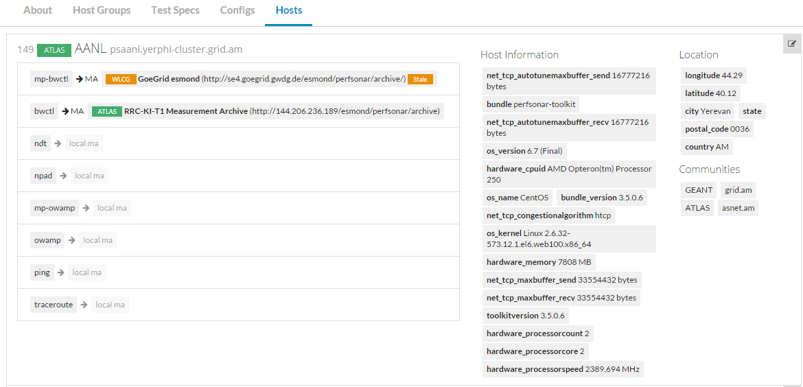
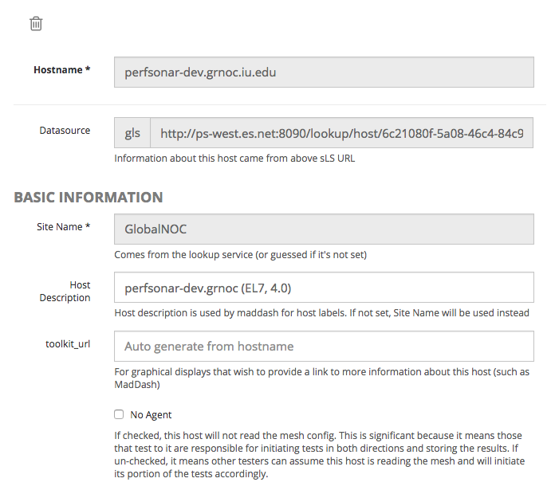
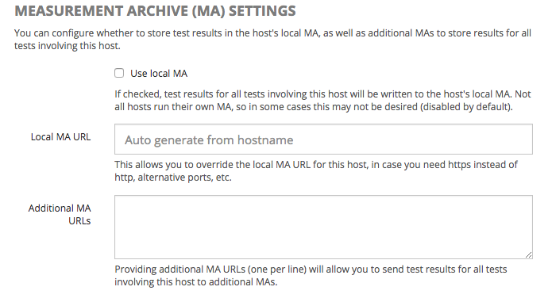

*****************
Hosts
*****************

The Hosts page displays a list of all hosts and services loaded from configured sLS datasources or defined manually (ad-hoc hosts). For non-super-admin, this is a read-only page mainly exists to
show which hosts are available, and host information available.

If you are a PWA super-admin, you can edit the host information and override Measurement Archive endpoints by clicking the pencil button on the right / top corner.

Basic Host Settings
-----------------------

* Site Name: The name of the site (typically this comes from the sLS)

* Host Description: The host description (will be displayed in Maddash as the row/column labels).

* toolkit_url: If toolkit_url is set to "auto", MadDash will use hostname of this record to auto-generate the URL that links back to the toolkit instance on maddash matrix view. If you use custom URL for your toolkit instance, change it to the real URL.

* No Agent: (As commented in UI)

Host-level Measurement Archive Settings
-----------------------

This section allows you to override MA settings at a host level.

* Use local MA: - Check this if this perfSONAR node should send test results to an MA running locally on the node. Disabled by default.

* Local MA URL: If left blank, this will be automatically generated. However, setting this allows you to override the local MA URL. This is mostly useful for forcing http or https archival, or running Esmond at a non-standard URL (not recommended).

* Additional MA URLs: Here you can specify additional MAs to archive test results to for all tests involving this host.

Host Details
-----------------------

This section simply displays a map and host information found in the sLS.

.. image:: images/pwa/host_detail.png

Host Membership
-----------------------

This section allows you to view communities, Host Groups and Configs that this host participates in.

.. image:: images/pwa/host_membership.png

Addresses 
-----------------------

Here you can view/edit the addresses associated with the host.

.. image:: images/pwa/host_addresses.png

