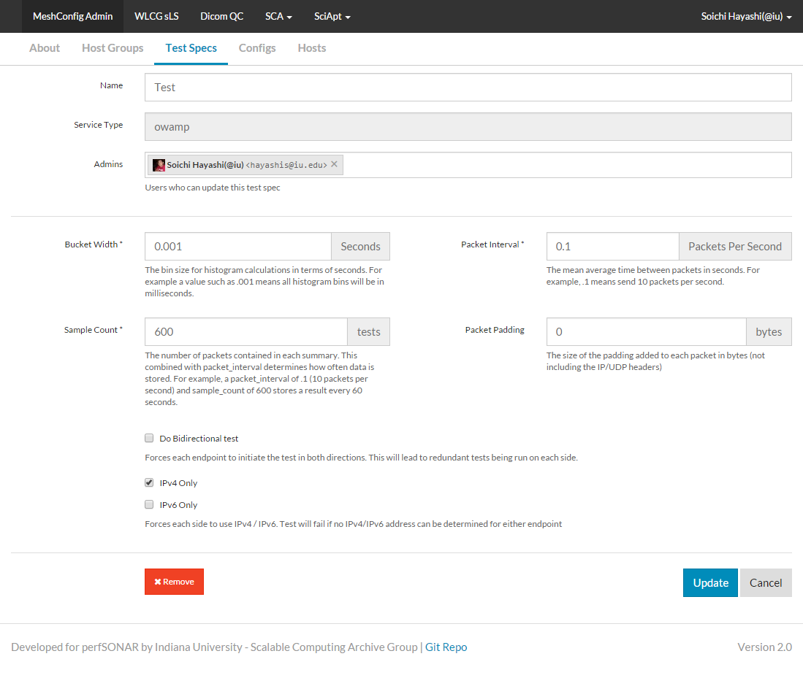

********************
Testspecs
********************

Testspecs are set of parameters used by a particular test services. Instead of defining such parameters for each test that you want to run, you can define them under Test Specs tab, and use them in one or more Configs.

.. image:: images/pwa/testspecs.png

Click the large "+" ("Add New") button to create a new Testspec, or click on a Testspec name to edit an existing Testspec.

* Name: Name of the Testspec 
* Service Type: Service type that this parameter set applies. This field is preselected when you click on "Add New" button.
* Admins: List of users who are admin of this test spec. Only admins or super-admins can edit the Testspecs.
* Depending on the service type, you will see different set of test parameters that you can enter. Please read comments on the UI for details about each parameter.

Please see :doc:`pwa_userguide_config` next.

