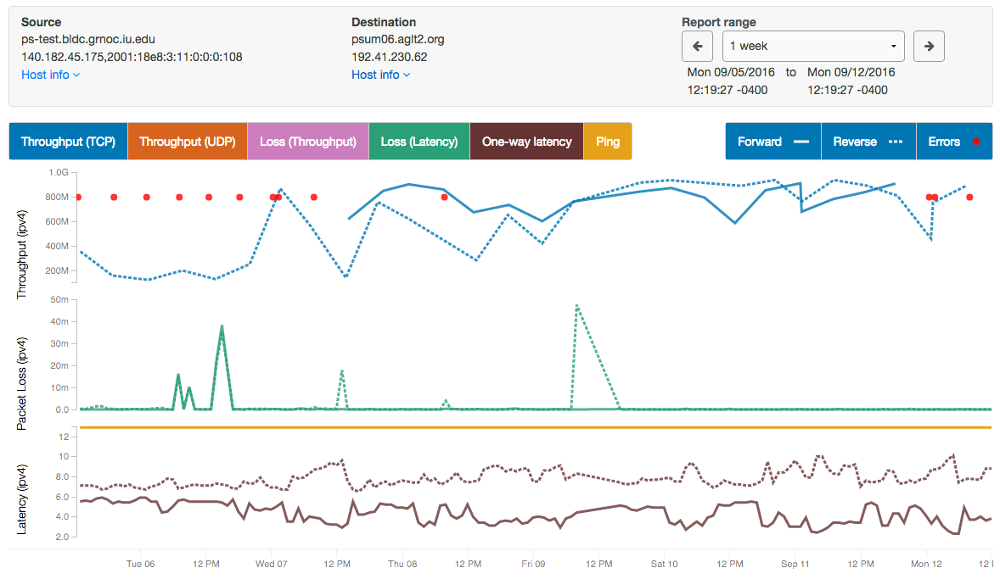

**********************
Regular Testing Graphs
**********************

Plots of perfSONAR results are generated by selecting "Throughput/Latency Graphs" on the Toolkit web interface and clicking
on a hostname, or by clicking on a box in the perfSONAR dashboard.

A sample perfSONAR data plot can be seen here.

Things to notice on this plot include the following:
 * The plot show bi-directional throughput, latency, and loss data all on the same plot
 * You can quickly switch between 1 day, 3 day, 1 week, 1 month, and 1 year plots. 
 * You can quickly bring up historical traceroute data for that path if it is being collected.
 * NIC speed and MTU info is shown at the top for both endpoints.
 * The 'link to this plot' link lets you share your view of the plot with others.
 * You can hover above the label at the bottom to highlight a given plot

Some other features include:

 * The bar at the bottom lets you easily zoom in on areas of interest

 .. image:: images/using_graphs_zoom.png
    :width: 400 px

 * You can hover above loss event to get more details

 .. image:: images/using_graphs_packet_loss.png
    :width: 200 px

 * You can hover above throughput data point also gives more details, including the number of TCP retransmits during the test

 .. image:: images/using_graphs_tput_retrans.png
    :width: 300 px

